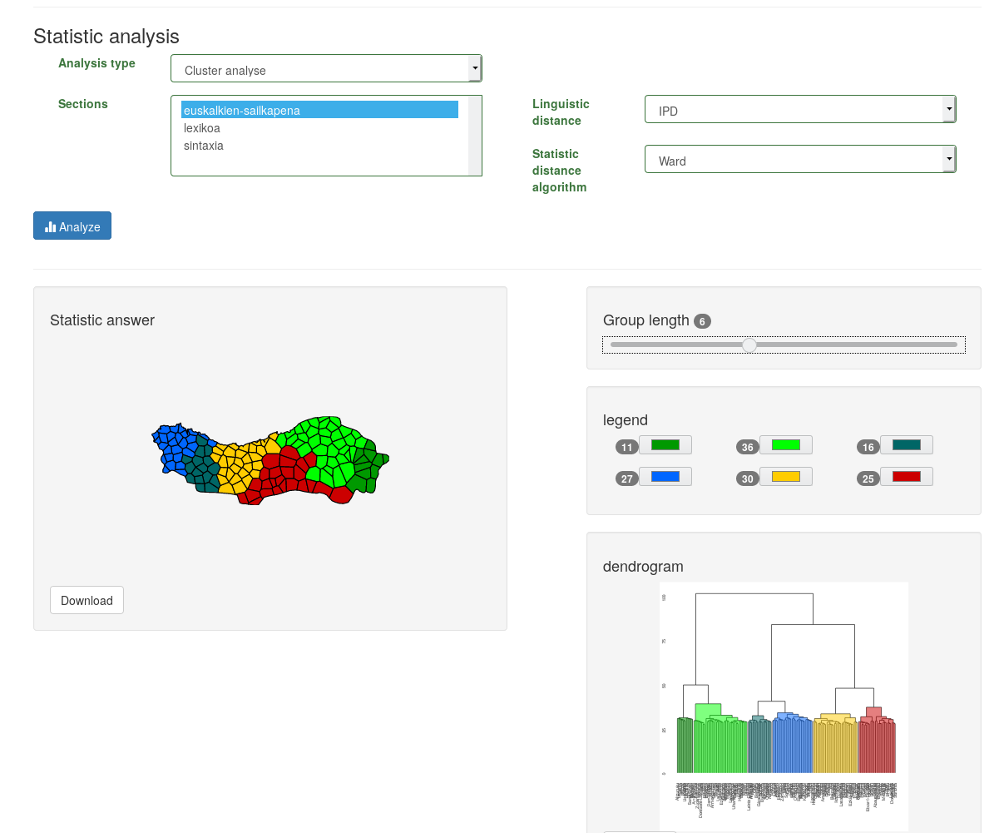
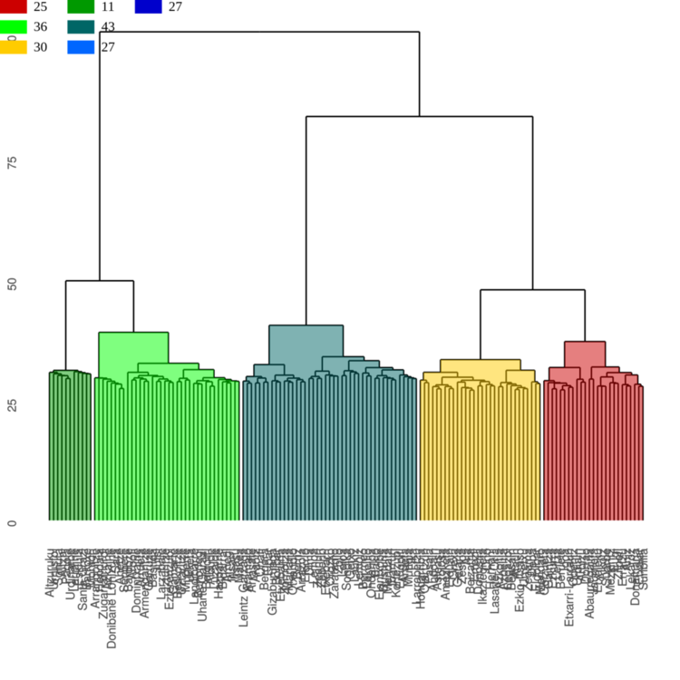
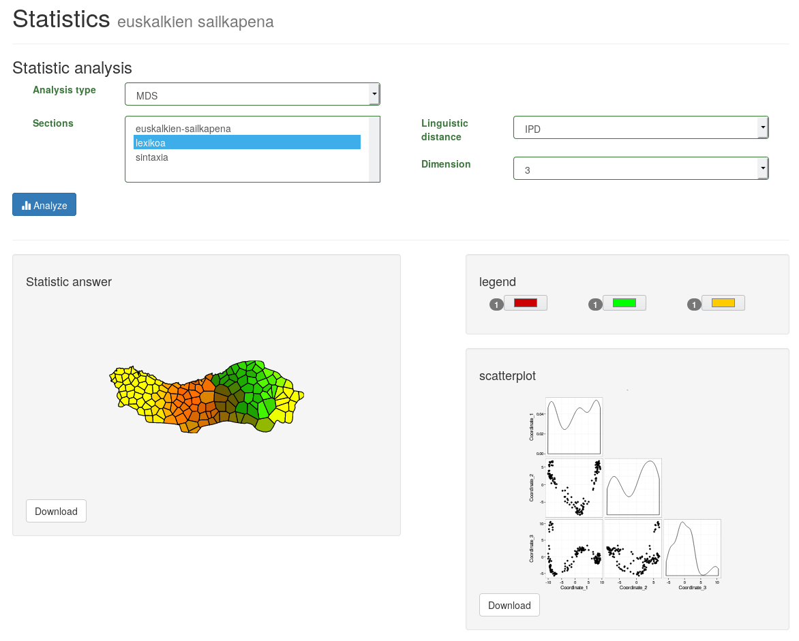

<style>
.slide-background:first-child {
  background-color: #f19143;
}
</style>

```{r setup, include=FALSE}
knitr::opts_chunk$set(echo = FALSE)
```

```{css}
<style>
 .col2 {
  columns: 2 200px;
  -webkit-columns: 2 200px;
  -moz-columns: 2 200px
 }
 .col3 {
  columns: 3 100px;
  -webkit-columns: 3 100px;
  -moz-columns: 3 100px
 }
 
</style>

<style>
 .colum-left {
  float: left;
  width 33%;
  text-align: left;
 }
 .colum-center {
  display: inline-block;
  width 33%;
  text-align: center;
 }
 .colum-right {
  float: right;
  width 33%;
  text-align: center;
 }
</style>
```


# DiaTech <small>A web tool for analyzing and visualysing linguistic variation:<br> http://eudia.ehu.eus/diatech/</small>

## [EHHA](https://www.euskaltzaindia.eus/index.php?option=com_ehha&view=frontpage&Itemid=466&lang=eu&gaia=Izen+morfologia%3A+izen+arrunten+deklinabide) <br> <small>Atlante delle parlate popolare basque</small>

# Analisi statistica dei corpus {data-background=#e88b40}

## 

>- Scuola di Salzburgo
>- Cluster analisi:
  >- Determinanti
  >- Fuzzy
>- MDS (Scalamiento Multi Dimenzionale)
>- Parlate frontiera o ponte. 
>- Nuovo analisi
>- Sottoinsieme

# Scuola di Salzburgo {data-background=#d87f3b}

## Dialettometrizazione dei corpus

```{r taula erakusteko, echo=FALSE, warning=FALSE}
a <- read.csv('data/bourciez-taulazabalduan-b.csv')[1:10, c(1,5:8)]
row.names(a) <- a[,1]
a <- a[,2:5]
names(a) <- 1:4

knitr::kable(a)
```

---

<small>

```{r warning=FALSE}
b <- fastDummies::dummy_cols(a, remove_first_dummy = FALSE)[5:16]
row.names(b) <- row.names(a)
knitr::kable(b)
```

</small>

## Distanze linguistiche

RIV / WIG (?)...

---

<small>

```{r warning=FALSE}
c <- tidyr::gather(a, key=galdera, value=lema, 1:4, factor_key = T)
d <- row.names(a)
c$herria <- rep(substr(d, 1, 7), 4)
knitr::kable(as.matrix(as.dist(diaMeasures::diaMeasure(c, herria ~ galdera, 'lema', 'iri'))))
```

</small>

## ...

# Clustering <br><small>analisi dei gruppi</small>  {data-background=#d07a39}

Agrupazione...

## Determinista <br><small>(clustering esclusivo)</small>



## 

## .png)

## Fuzzy  <br><small>(clustering non-esclusivo)</small>

# MDS {data-background=#af6530}

## La distanzia linguistica insegue a Pitagora

### Ma non si apoggia nella nostra perspettiva <br> dimenzionalle dalla realtà

## Riduzione delle dimensionalta



## .png)

## .png)

# Parlate-frontiera <br> parlate-ponte {data-background=#7c4722}

## 

# Sottoinsieme {data-background=#6f3e1d}

## 

# Un altra prospettiva della distanza linguistica {data-background=#593218}

## Distanzia della edizione

# Nuovi prospettiva {data-background=#381f0f}

## Modellizzazione matematiche delle variazioni

## Analisi delle Corrispondenze Multiple (MCA) 


## References

Aurrekoetxea et al. (2016) Diatech: Tool for making dialectometry eaiser [1](papers/Aurrekoetxea_et_al_2016_Diatech.pdf)

Aurrekoetxea et al. (2016) Analysis of the morphological variation of Basque [2](papers/Aurrekoetxea_2016_Analysis_of_the.pdf)

## {data-background=#1a0e07}

<small>eudia</small><br><br>juan (dot) abasolo (at) ehu (dot) eus